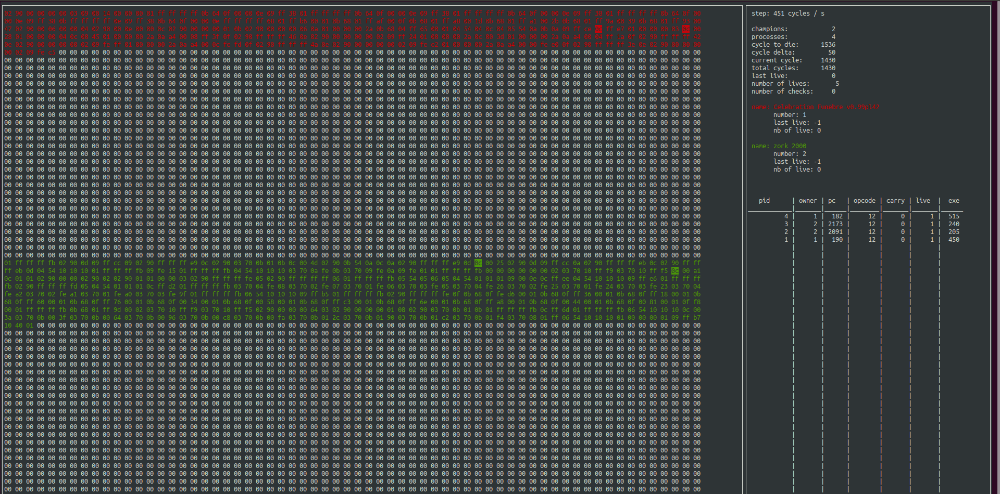

# Corewar

This is one of the (actually) five final projects concluding the first part of [42](https://42.fr/) cursus.

## About

> Core War is a 1984 programming game created by D. G. Jones and A. K. Dewdney in which two or more battle programs (called "warriors") compete for control of a virtual computer. These battle programs are written in an abstract assembly language called Redcode.

[wikipedia](https://en.wikipedia.org/wiki/Core_War)

## Full subject

(in french)
[pdf](./subject/corewar.fr.pdf)

This subject is mainly about team work on a large project and clean code.

## Installation & Usage:

```bash
git clone https://github.com/zcugni/corewar.git && cd corewar && make
```

to compile a champion to a .cor file
```bash
./asm <file.s>
```

to start a fight (up to 4 fighter):
```bash
./vm <file.cor> <…>
```
or to have a visualization of the fight (made with ncurses)
```bash
./vm -nc <file.cor> <…>
```

to see every options available for the vm
```bash
./vm
```

## What does it looks like



## The Team

||||
| --------- | --------- | --------  |
| [alouisy](https://github.com/alouisy) |[jgroc-de](https://github.com/jgroc-de)|[zcugni](https://github.com/zcugni)|
