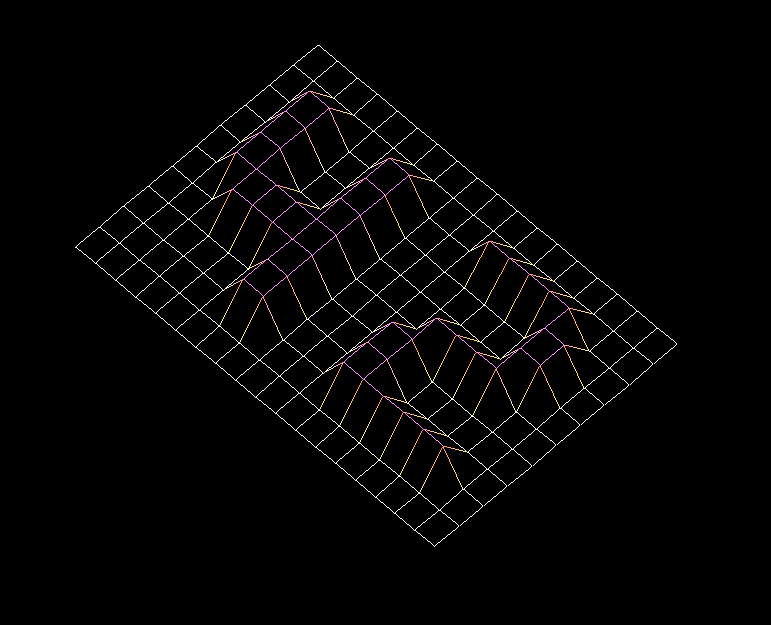

# FDF

> Vous decouvrirez dans ce projet les bases de la programmation graphique, et en particulier, le placement de points dans l’espace, comment les relier avec des segments et surtout comment observer la scène depuis un certain point de vue

## exemple de map d'entrée

- 0  0  0  0  0  0  0  0  0  0  0  0  0  0  0  0  0  0  0
- 0  0  0  0  0  0  0  0  0  0  0  0  0  0  0  0  0  0  0
- 0  0 10 10  0  0 10 10  0  0  0 10 10 10 10 10  0  0  0
- 0  0 10 10  0  0 10 10  0  0  0  0  0  0  0 10 10  0  0
- 0  0 10 10  0  0 10 10  0  0  0  0  0  0  0 10 10  0  0
- 0  0 10 10 10 10 10 10  0  0  0  0 10 10 10 10  0  0  0
- 0  0  0 10 10 10 10 10  0  0  0 10 10  0  0  0  0  0  0
- 0  0  0  0  0  0 10 10  0  0  0 10 10  0  0  0  0  0  0
- 0  0  0  0  0  0 10 10  0  0  0 10 10 10 10 10 10  0  0
- 0  0  0  0  0  0  0  0  0  0  0  0  0  0  0  0  0  0  0
- 0  0  0  0  0  0  0  0  0  0  0  0  0  0  0  0  0  0  0

## sortie correspondante

